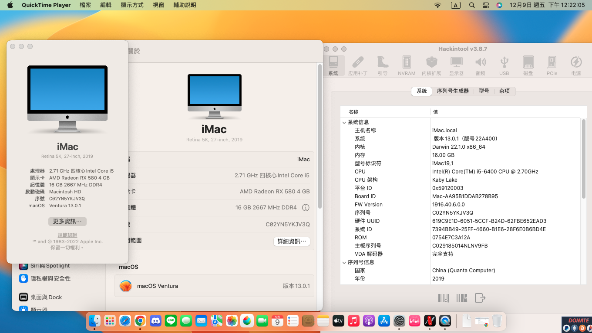

# ASUS-Z170-A-Skylake-Kabylake-OC-Hackintosh

## 🖥️Device

| Motherboard | Asus Z170-A |
|------------|-------------------------------|
| CPU-Skylake | i5 6400(Skylake 1151 CPUs) |
| CPU-Kabylake | i7 7700(Kabylake 1151 CPUs) |
| dGPU | AMD Radeon RX580 |
| iGPU-Skylake | Intel® HD Graphics 530 |
| iGPU-Kabylake | Intel® HD Graphics 630 |
| Hard-drive | NVMe SSD CT1000P2SSD8 |
| RAM | DDR4 2666MHz 32GB |
| Audio | Realtek ALC892 |
| WIFI／Bluetooth | FV-T919(BCM94360cd) |
| Ethernet | Intel® I219-V |
| BIOS Version | 3802 |

## OS

### macOS Ventura 

**Noteice**:  

|  |
|------------|
| <a href="https://www.apple.com/tw/macos/macos-ventura-preview/">macOS Ventura 13.1 |
| <a href="https://github.com/acidanthera/OpenCorePkg/releases/tag/0.9.2">Opencore 0.9.2 |
| <a href="https://dortania.github.io/OpenCore-Install-Guide/extras/smbios-support.html">iMac 19.1 |

- <a href="https://github.com/ParrotXray/ASUS-Z170-A-Skylake-Kabylake-OC-Hackintosh/releases/tag/v0.9.2">Click me to download EFI file

## 💡Device status
### Works：
- [x] Graphics
- [x] USB
- [x] Sleep
- [x] WiFi
- [x] Speakers
- [x] Microphone
- [x] Bluetooth
- [x] Ethernet
- [x] AirDrop
- [x] Apple Services

## 🛠️OC DevicePropertises setting
#### Use iGPU+dGPU hardware acceleration
`PciRoot(0x0)/Pci(0x2,0x0)`
| key |  Data Type  |  Value
:-------------------------:|:-------------------------:|:-------------------------:
AAPL,ig-platform-id|Data|03001259
device-id|DATA|12590000
model|String|Intel HD Graphics 630

#### Use iGPU
`PciRoot(0x0)/Pci(0x2,0x0)`
| key |  Data Type  |  Value
:-------------------------:|:-------------------------:|:-------------------------:
AAPL,ig-platform-id|Data|00001259
device-id|DATA|16590000
model|String|Intel HD Graphics 630
#### Audio
`PciRoot(0x0)/Pci(0x1F,0x3)`
| key |  Data Type  |  Value
:-------------------------:|:-------------------------:|:-------------------------:
layout-id|Number|3

notice:Skylake igpu is painted in Ventura to counterfeit kabylake igpu and must be in `NVRAM > 7C436110-AB2A-4BBB-A880-FE41995C9F82 > boot-args > Add` **`-disablegfxfirmware lilucpu=9 -igfxsklaskbl`**

## 🛠️Setting BIOS

#### CPU Configuration:

- Advanced/CPU Configuration/Intel Virtuallzation Technology：`Enabled`

- Advanced/CPU Configuration/CPU - Power Management Control/CPU C-states：`Enabled`

- Advanced/CPU Configuration/CPU - Power Management Control/CFG Lock：`Disabled`

#### PCH onfiguration:

- Advanced/PCH Configuration/IOAPIC 24-119 Entries：`Disabled`

#### PCH Storage Configuration:

- Advanced/PCH Storage Configuration/SATA Mode Selection：`AHCI`

#### USB:

- Advanced/USB Configuraton/Legacy USB Support：`Enabled`

#### Fix Sleep:

- Advanced/Onboard Devices Configuration/Serial Port Configuration/Serial Port：`off`

#### Boot:

- Boot/Fast Boot：`Disabled`

- Boot/CSM/Launch CSM：`Disabled`

- Boot/Secure Boot/OS Type：`Other OS`

### System Agent(SA) Configuration:

- Advanced/System Agent Configuration/VT-d：`Disabled`

#### Use iGPU:

- Advanced/System Agent(SA) Configuration/Graphics Configuration/Primary Display：`iGPU`

- Advanced/System Agent(SA) Configuration/Graphics Configuration/iGPU Memory：`64M`

#### Use dGPU:

- Advanced/System Agent(SA) Configuration/Graphics Configuration/Primary Display：`PEG`

#### Use dGPU+iGPU hardware acceleration:

- Advanced/System Agent(SA) Configuration/Graphics Configuration/Primary Display：`PEG`

- Advanced/System Agent(SA) Configuration/Graphics Configuration/iGPU Memory：`64M`

- Advanced/System Agent(SA) Configuration/Graphics Configuration/iGPU Multi-Momltor：`Enabled`
